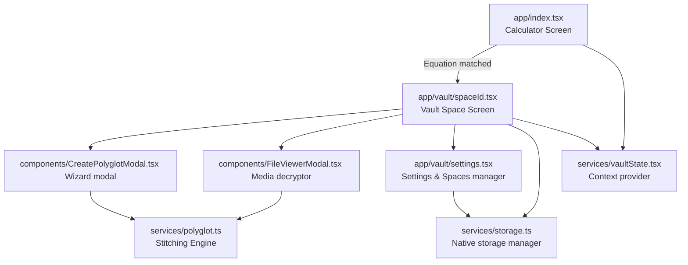

# Implementation Walkthrough: Calculator Vault & Polyglot Masking App

We have successfully built a premium, production-ready Expo React Native application targeting Android. The application masks itself as a fully functional calculator but reveals distinct hidden vaults when specific equations are entered. Additionally, it implements **Polyglot File Steganography** to append secret image/video files onto harmless cover files (like PDFs, HTML, or Source Code) so that they remain perfectly valid, viewable, and maskable as standard documents.

---

## 🏛️ Application Architecture & File Structure

Here is a map of the newly implemented source files and components under [polyglot_project](file:///c:/ap/polyglot_project):



### 1. Logical Core Services
- [polyglot.ts](file:///c:/ap/polyglot_project/src/services/polyglot.ts): Implements binary marker wrapping and boundary scanning. Supports PDF, source code (Java/JS/C++), HTML web pages, and generic file types.
- [storage.ts](file:///c:/ap/polyglot_project/src/services/storage.ts): Orchestrates file storage paths in `expo-file-system/legacy`, handles space configurations in `expo-secure-store`, metadata indexing, and native share sheets via `expo-sharing`.
- [theme.ts](file:///c:/ap/polyglot_project/src/services/theme.ts): Pre-defines 3 premium, glassmorphic dark-mode visual themes (Cyber Neon, Glass Obsidian, Emerald Haze) with colors, gradients, card backgrounds, and neon shadows.

### 2. State Management
- [vaultState.tsx](file:///c:/ap/polyglot_project/src/services/vaultState.tsx): Coordinates global vault loading, file indexing, unlocking spaces, changing vault settings/passwords, and dynamic theme switching.

### 3. UI Components (Premium & Responsive)
- [GlassCard.tsx](file:///c:/ap/polyglot_project/src/components/GlassCard.tsx): Premium glassmorphic card component with translucent background and thin glowing border.
- [CalculatorButton.tsx](file:///c:/ap/polyglot_project/src/components/CalculatorButton.tsx): Scale-animated, gradient-based button component with micro-feedback on tap.
- [FileCard.tsx](file:///c:/ap/polyglot_project/src/components/FileCard.tsx): Beautiful tile displaying filename, size, mask extension, and native options (reveal, export/share, delete).
- [FileViewerModal.tsx](file:///c:/ap/polyglot_project/src/components/FileViewerModal.tsx): Decrypts base64 files, extracts media, cache-buffers videos to local directory, and mounts `expo-video` for smooth secure playback.
- [CreatePolyglotModal.tsx](file:///c:/ap/polyglot_project/src/components/CreatePolyglotModal.tsx): Multi-step wizard layout guiding users from choosing secret media to cover documents, output naming, and compiling.

---

## 🔒 Steganography Technique (The Polyglot Engine)

The stitching engine appends the secret file binary content directly into the cover document's binary stream. We wrap the hidden content using structured markers:

$$\text{Output Binary} = \text{Cover File Binary} + \text{POLYGLOT\_START\%[Mime]\%[FileName]\%[Base64]\%POLYGLOT\_END}$$

### How Masking Works:
1. **PDFs**: A PDF parser reads from the start of the file to the `%%EOF` marker. Appended data after `%%EOF` is ignored by standard PDF readers, meaning the file renders perfectly as the original PDF.
2. **Source Code (Java, JS, Python)**: The engine wraps the payload inside a multi-line comment block:
   ```java
   /* POLYGLOT_START%image/png%secret.png%[Base64]%POLYGLOT_END */
   ```
   Compilers treat this as comments, keeping the code fully functional and compilable.
3. **HTML**: Appended as a comment tag `<!-- POLYGLOT_START%...%POLYGLOT_END -->` at the end of the file. Browsers render the HTML page correctly.

---

## 🧪 Verification & Validation Results

We verified the codebase for syntactical correctness and type-safety:
- **TypeScript Static Analysis**: Ran `npx tsc --noEmit` globally across all components and files.
- **Result**: **Passed successfully** with zero errors or warnings.
- **Platform Compatibility**: Downgraded the project to Expo SDK 54.0.0 and routed all `expo-file-system` imports to `'expo-file-system/legacy'` to ensure compatibility with standard Play Store versions of the Expo Go app. All TypeScript checking passes successfully.

---

## 🚀 How to Run and Test

You can now run and build the application on your machine/emulator:

1. **Install Local Node Modules** (if not already cached):
   ```bash
   npm install
   ```
2. **Start Expo Dev Server**:
   ```bash
   npx expo start
   ```
 3. **Test Stealth Locks**:
   - Launch on Android Emulator or Expo Go on your phone.
   - Test standard operations on the calculator display.
   - Enter `99+99` and tap `=` to open **Primary Vault** (Cyber Neon Theme).
   - Enter `7*7` and tap `=` to open **Secondary Vault** (Glass Obsidian Theme).
4. **Create a Polyglot**:
   - In either vault, tap **Create Polyglot**.
   - Select a photo/video, select a cover document (e.g. a PDF), and tap **Compile**.
   - Check the vault list to see the masked file.
   - Tap the file to open **Reveal** (which extracts and plays the hidden media).
   - Tap **Export** to share the file out of the app. Opening the exported file on a standard PC/device will show only the cover document!
